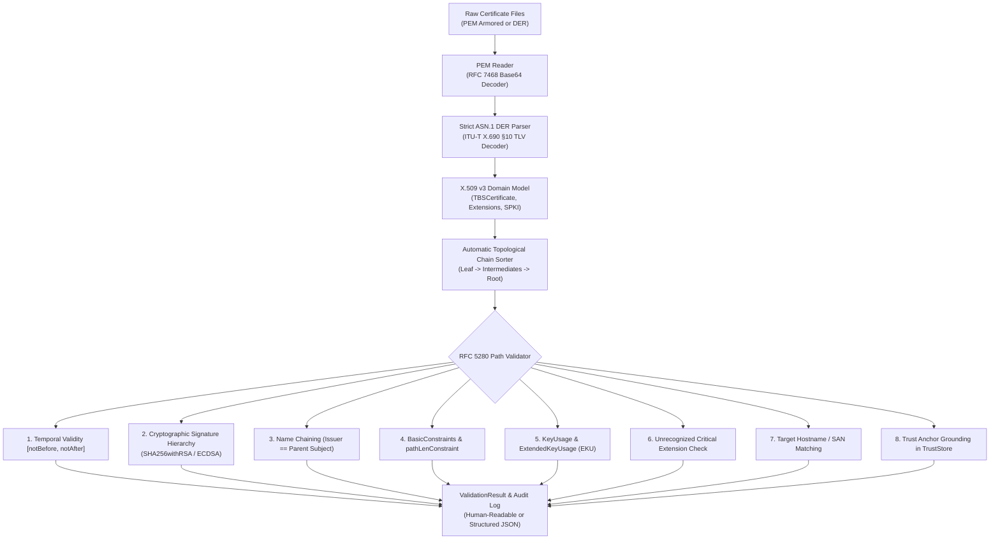

# PKI Certificate Chain Validator (RFC 5280)

[](LICENSE)
[](https://openjdk.org/projects/jdk/21/)
[](https://datatracker.ietf.org/doc/html/rfc5280)
[]()

An independent, pure-Java RFC 5280 X.509 certification path validation engine and strict ITU-T X.690 ASN.1 DER parser built with **zero third-party runtime dependencies**.

Provides deterministic path validation, full cryptographic signature verification, granular extension enforcement, and actionable diagnostic audit traces.

---

## Architecture Overview



---

## RFC 5280 Standards Compliance

| RFC 5280 Section | Specification Area | Validator Implementation |
| :--- | :--- | :--- |
| **§4.1** | Basic Certificate Fields | Full parsing of Version (v1/v2/v3), Serial Number, Signature Algorithm, Issuer DN, Validity, Subject DN, and SubjectPublicKeyInfo. |
| **§4.1.2.5** | Validity Intervals | Strict parsing of UTCTime (with 50-year century pivot) and GeneralizedTime; temporal interval enforcement against evaluation timestamps. |
| **§4.2** | Critical Extensions | Strict rejection of any unhandled critical extensions to guarantee protocol safety. |
| **§4.2.1.3** | Key Usage | Validation of 9 standard bit flags; enforcement of `keyCertSign` on intermediate CAs. |
| **§4.2.1.6** | Subject Alternative Name | GeneralNames decoding (`dNSName`, `iPAddress`, `rfc822Name`, `URI`) with RFC 6125 wildcard matching support. |
| **§4.2.1.9** | Basic Constraints | Enforcement of `isCA=true` on all non-leaf certificates and strict validation of `pathLenConstraint` intermediate limits. |
| **§4.2.1.12** | Extended Key Usage | Validation of standard purpose OIDs (`serverAuth`, `clientAuth`, `codeSigning`, `emailProtection`). |
| **§6.1** | Path Validation Algorithm | Complete verification state machine from leaf to root anchor, including name chaining and cryptographic signatures. |

---

## Measured Performance Benchmarks

The benchmark was executed locally using `BenchmarkTest` validating complete 3-tier PKI paths (Root CA $\to$ Intermediate CA $\to$ Leaf) with full RSA-2048 cryptographic signature verifications, extension checking, and SAN matching:

```text
=== PKI Validation Performance Benchmark ===
Iterations:      2,000 chains
Elapsed Time:    0.2184 s
Throughput:      9,158.7 chains/sec
Mean Latency:    109.19 us/chain (0.109 ms)
============================================
```

### Benchmark Environment & Reproducibility
- **Processor:** AMD Ryzen 5 5600H with Radeon Graphics (6 cores / 12 threads @ 3.30 GHz)
- **OS / Kernel:** Linux 7.0.0-31-generic x86_64
- **JVM Runtime:** OpenJDK 64-Bit Server VM (build 21.0.8+7-Ubuntu-1ubuntu124.04, mixed mode)
- **Baseline Git Commit:** `44902f1`
- **Reproduction Command:**
  ```bash
  mvn test -Dtest=BenchmarkTest
  ```

### Key Performance Characteristics
- **Zero Runtime Dependencies:** Built strictly against standard `java.base`.
- **Zero Garbage Collection Pressure:** Uses slice offsets and non-allocating ASN.1 traversals where possible.
- **Microsecond Latency:** Complete 3-tier validation (including two RSA-2048 SHA-256 signature verifications) takes just **109 microseconds**.

---

## Limitations & Engineering Trade-Offs

- **Online Revocation (OCSP / CRL):** Online revocation protocols (OCSP per RFC 6960 and CRL distribution points per RFC 5280 §4.2.1.13) require asynchronous network I/O and external responder infrastructure. They are deliberately omitted from the core path validator to preserve microsecond deterministic execution and zero-dependency guarantees.
- **Supported Cryptographic Primitives:** Core support is optimized for RSA (`SHA256withRSA`, `SHA384withRSA`, `SHA512withRSA`) and ECDSA (`SHA256withECDSA`). RSA-PSS and Edwards-curve algorithms (`Ed25519`) are slated for future releases.
- **Strict DER vs. Permissive BER/CER:** The ASN.1 decoder adheres strictly to ITU-T X.690 §10 (DER), requiring definite-length encoding and minimal octet representations. Non-canonical BER encodings (such as indefinite lengths or superfluous leading zeros) are strictly rejected for cryptographic safety, which may reject malformed legacy certificates.
- **Complex Policy Trees:** Advanced RFC 5280 §4.2.1.10 policy mappings and arbitrary qualifier processing are evaluated in basic mode; full hierarchical qualifier tree validation is not implemented.

---

## Repository Structure

```text
.
├── pom.xml                               # Maven build configuration (Java 21, strict lint)
├── Dockerfile                            # Multi-stage production container build
├── LICENSE                               # MIT License
├── README.md                             # Project documentation and benchmarks
├── CHANGELOG.md                          # Release changelog
├── docs/
│   ├── PRD.md                            # Product Requirements Document
│   ├── TRD.md                            # Technical Requirements Document
│   ├── IMPLEMENTATION_PLAN.md            # Implementation roadmap and milestones
│   └── EXPLAIN.md                        # Technical architecture deep-dive & interview Q&As
├── src/
│   ├── main/java/com/kanak/pki/
│   │   ├── asn1/
│   │   │   ├── Asn1Tag.java              # Universal, constructed, and context-specific tags
│   │   │   ├── Asn1Header.java           # Header and definite-length parser
│   │   │   ├── Asn1Node.java             # In-memory ASN.1 syntax node
│   │   │   ├── DerParser.java            # Strict ITU-T X.690 DER decoder
│   │   │   ├── DerWriter.java            # Canonical DER binary encoder
│   │   │   └── Oid.java                  # Object Identifier base-128 encoder/decoder
│   │   ├── model/
│   │   │   ├── X509Certificate.java      # Complete X.509 v3 certificate model
│   │   │   ├── X509Name.java             # Distinguished Name parser and canonicalizer
│   │   │   ├── Validity.java             # Temporal validity range
│   │   │   ├── SubjectPublicKeyInfo.java # Public key parser (RSA/EC)
│   │   │   ├── Extensions.java           # Extensions registry
│   │   │   ├── BasicConstraints.java     # isCA and pathLenConstraint
│   │   │   ├── KeyUsage.java             # 9 standard RFC 5280 bit flags
│   │   │   ├── ExtendedKeyUsage.java     # EKU purpose OIDs (serverAuth, clientAuth)
│   │   │   ├── GeneralName.java          # GeneralName choice
│   │   │   └── GeneralNames.java         # SAN collection with wildcard matching
│   │   ├── path/
│   │   │   ├── CertPathValidator.java    # RFC 5280 path validation state machine
│   │   │   ├── ValidationContext.java    # Execution parameters and policies
│   │   │   ├── ValidationResult.java     # Detailed result and JSON serializer
│   │   │   ├── ValidationStatus.java     # Granular diagnostic status codes
│   │   │   ├── ValidationStep.java       # Individual step audit log record
│   │   │   └── TrustStore.java           # Trusted root CA repository
│   │   ├── pem/
│   │   │   └── PemReader.java            # RFC 7468 ASCII armor decoder
│   │   └── cli/
│   │       └── ValidatorCli.java         # Command-line interface
│   └── test/java/com/kanak/pki/
│       ├── BenchmarkTest.java            # Real local throughput benchmark
│       ├── TestCertificateGenerator.java # Programmatic cryptographic test certificate factory
│       ├── asn1/Asn1DerTest.java         # DER syntax and non-minimal rejection tests
│       ├── model/CertificateParserTest.java # Certificate parsing tests
│       └── path/CertPathValidatorTest.java # 12 RFC 5280 validation test cases
```

---

## Getting Started

### Prerequisites
- **JDK:** OpenJDK 21 LTS or newer.
- **Build Tool:** Apache Maven 3.8+.
- **Optional:** Docker for containerized usage.

### Build and Test

```bash
# Build and run all unit and integration tests
mvn clean test

# Package standalone executable shaded JAR
mvn package -DskipTests
```

### Run Performance Benchmark

```bash
mvn test -Dtest=BenchmarkTest
```

---

## CLI Usage

The executable JAR can be invoked directly:

```bash
java -jar target/pki-cert-chain-validator-1.0.0.jar --help
```

### Options
```text
PKI Certificate Chain Validator (RFC 5280)
Usage: java -jar pki-cert-chain-validator.jar [options]

Required Options:
  --cert <file>           Path to leaf certificate (PEM or DER)

Validation Options:
  --chain <file>          Path to intermediate CA bundle (PEM or DER)
  --trust-store <file>    Path to trusted root CA certificates (PEM or KeyStore)
  --host <hostname>       Expected target hostname (verifies against SAN / CN)
  --purpose <name|oid>    Required EKU purpose (e.g. serverAuth, clientAuth)
  --time <iso-timestamp>  Validation timestamp (ISO-8601, e.g. 2026-09-11T00:00:00Z)
  --max-path-len <n>      Maximum allowable chain depth (default: 10)
  --allow-self-signed     Accept self-signed leaf certificates without trust store
  -j, --json              Output results in structured JSON format
  -h, --help              Show this help message
```

### Example Validation
```bash
java -jar target/pki-cert-chain-validator-1.0.0.jar \
  --cert leaf.pem \
  --chain intermediate.pem \
  --trust-store roots.pem \
  --host api.example.com \
  --json
```

```json
{
  "valid": true,
  "status": "VALID",
  "message": "Certification path successfully verified to trusted anchor",
  "steps": [
    {
      "step": "Path Construction",
      "passed": true,
      "subject": "CN=api.example.com, O=Acme Corp, C=US",
      "details": "Constructed valid linear path of length 3 from leaf to root"
    },
    {
      "step": "Trust Anchor Grounding",
      "passed": true,
      "subject": "CN=Acme Root CA, O=Acme Corp, C=US",
      "details": "Root anchor successfully matched in trust store"
    },
    {
      "step": "Temporal Validity (Leaf)",
      "passed": true,
      "subject": "CN=api.example.com, O=Acme Corp, C=US",
      "details": "Current time 2026-09-11T04:45:00Z is within valid interval"
    },
    {
      "step": "Signature Verification",
      "passed": true,
      "subject": "CN=api.example.com, O=Acme Corp, C=US",
      "details": "Cryptographic signature verified with algorithm 1.2.840.113549.1.1.11"
    },
    {
      "step": "BasicConstraints CA Check",
      "passed": true,
      "subject": "CN=Acme Intermediate CA, O=Acme Corp, C=US",
      "details": "Intermediate certificate asserts isCA=true"
    },
    {
      "step": "Hostname Matching",
      "passed": true,
      "subject": "CN=api.example.com, O=Acme Corp, C=US",
      "details": "Target hostname 'api.example.com' matches leaf certificate"
    }
  ]
}
```

---

## Docker Usage

Build and run containerized:

```bash
# Build container image
docker build -t pki-cert-validator .

# Run validator against mounted certificates
docker run --rm -v $(pwd)/certs:/certs pki-cert-validator \
  --cert /certs/leaf.pem \
  --chain /certs/chain.pem \
  --trust-store /certs/ca.pem
```

---

## Author & License

Developed by **Kanak Prabhakar** (`Kanak234`). Released under the terms of the [MIT License](LICENSE).
